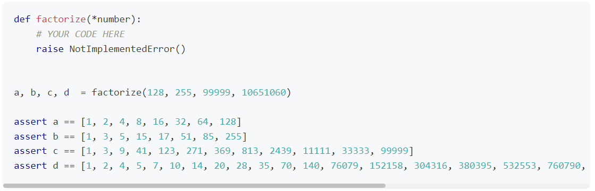

## Домашнее задание

Напишите реализацию функции factorize, которая принимает список чисел и возвращает список чисел, на которые числа из входного списка делятся без остатка.

Реализуйте синхронную версию и измерьте время выполнения.

Потом улучшите производительность вашей функции, реализовав использование нескольких ядер процессора для параллельных вычислений, и замерьте время выполнения опять.

Для проверки правильности работы алгоритма самой функции можете воспользоваться тестом:

